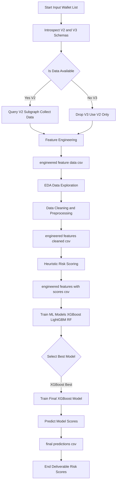

# Wallet-Risk-Scoring

This project extracts data for a list of 100 crypto wallets using subgraph queries and assigns risk scores through a combination of heuristic methods and machine learning. Scores range from **1 (safest)** to **1000 (most risky)**, with a final predictive model built using **XGBoost**.

---

### ⚠️ Scoring Scale:
**1 = Safest**, **1000 = Riskiest**

---

### 🚀 Workflow Overview:

---

### 🧾 Project Description:

## Risk Assessment of Compound V2 Wallets

This repository presents an end-to-end pipeline that performs on-chain wallet risk evaluation based on interaction with the Compound V2 protocol on Arbitrum. It incorporates subgraph data querying, feature construction, risk modeling, and ML-based scoring.

---

## Key Highlights

This project establishes a comprehensive scoring framework for evaluating DeFi wallet risk using blockchain subgraph data. The key steps include:

- **Subgraph Schema Evaluation:** Performed introspection on Compound V2/V3 subgraphs to determine usable fields for wallet analysis.
- **Data Acquisition:** Extracted data from V2 subgraph endpoints for over 100 wallets using custom Python scripts. Due to the unavailability of wallet-level data in V3 subgraphs, the pipeline was adjusted to process V2 data exclusively.
- **Feature Engineering:** Converted raw wallet activity (transactions, balances, etc.) into structured features capturing risk behavior, lending/borrowing dynamics, and protocol usage.
- **Data Analysis & Cleaning:** Conducted exploratory data analysis (EDA), identified missing data/outliers, and applied techniques like log transformation, clipping, and redundancy elimination to improve model robustness.
- **Heuristic Risk Assignment:** Built a domain-informed, weighted scoring mechanism that ranks wallets between 1 (low risk) and 1000 (high risk).
- **Model Evaluation:** Compared multiple regressors (XGBoost, LightGBM, Random Forest). XGBoost performed best, achieving optimal RMSE and R².
- **Final Scoring Output:** Trained the final XGBoost model and exported the wallet-wise risk scores for practical use.

---

## 🔧 Tech Stack

- **Python 3:** Core scripting and data processing
- **Pandas & NumPy:** Data manipulation and feature engineering
- **Jupyter / Google Colab:** Analysis, visualization, and model development
- **XGBoost, LightGBM, scikit-learn:** ML training and benchmarking
- **GraphQL via The Graph API:** On-chain data extraction from the Compound V2 subgraph

---

## ✅ Benefits

- **Explainable and actionable scores** that provide clarity for DeFi protocols, risk analysts, and auditors.
- **Resilience to data noise:** Preprocessing methods counteract extreme values and inactivity.
- **Modular architecture:** Easily extendable to other protocols or additional data sources.
- **Data-driven enhancements over heuristics:** ML models fine-tune initial rule-based scoring with learned behavior.

---

## 📌 Why It’s Useful

This system empowers DeFi teams to evaluate wallet trustworthiness and lending risk using transparent and scalable tools. It offers an essential resource for credit modeling, protocol monitoring, and on-chain risk compliance.

---

## ⚠️ Limitations

- **Whale Dominance:** Some wallets with exceptionally large balances disproportionately influenced the feature distributions, which may have led to reduced scoring accuracy for smaller wallets.
- **Inactive Wallets:** Many wallets lacked activity, resulting in sparse or zeroed-out features, which limited scoring granularity.
- **Limited Dataset:** The analysis was constrained to ~100 wallets, which reduced behavioral diversity and model generalization. A larger sample could enhance prediction quality and robustness.
